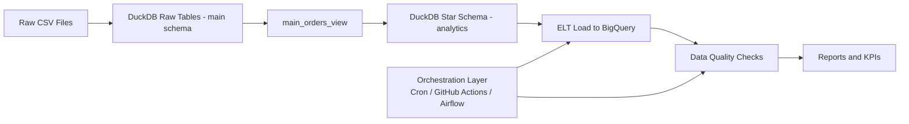

# Data Pipeline Architecture

## 1) System Overview
This project implements an e-commerce analytics pipeline that:

1. Ingests raw CSV data into DuckDB.
2. Transforms data into an `analytics` star schema.
3. Loads curated tables to BigQuery (ELT).
4. Runs data quality checks (Great Expectations + SQL checks).
5. Produces reports and analytics outputs.

## 2) Code Structure
Key project artifacts:

- `main.ipynb`: End-to-end notebook covering ingestion, transformation, ELT, and analytics steps.
- `data_quality_test_plan.ipynb`: Data quality rules and execution plan (nulls, duplicates, RI, business logic).
- `great-expectation.ipynb`: Extended Great Expectations validation workflow.
- `pipeline_orchestration_plan.ipynb`: Scheduling/orchestration options (cron, GitHub Actions, Airflow).
- `workflow.md`: Process flow and implementation notes.
- `olist_ecommerce_star.db`: Local DuckDB star-schema database (not tracked in Git).

## 3) Data Lineage
Source to consumption lineage:

1. Raw CSV files (orders, customers, products, sellers, payments, geolocation, etc.)
2. DuckDB `main` schema raw tables
3. `main_orders_view` consolidation layer
4. DuckDB `analytics` schema:
   - Dimensions: `dim_customer`, `dim_product`, `dim_seller`, `dim_geolocation`, `dim_time`
   - Fact: `fact_orders`
5. BigQuery analytical dataset/tables
6. Validation and reporting artifacts:
   - DQ checks
   - PDF/summary outputs
   - Dashboard/KPI queries

## 4) Pipeline Architecture

## 5) Orchestration Design
Recommended scheduled flow:

1. Run ELT (`main.ipynb` or equivalent scriptized job).
2. Run DQ checks (`data_quality_test_plan.ipynb`).
3. Persist logs/artifacts.
4. Alert on failures.

Supported orchestration options:

- Cron job (local scheduler)
- GitHub Actions (scheduled CI/CD)
- Airflow / Composer / Dagster (managed orchestration)

## 6) Diagramming in Draw.io / Excalidraw
Use this section as the source content for architecture diagrams.

Suggested blocks:

1. `Raw Layer`: CSV files
2. `Staging Layer`: DuckDB raw tables
3. `Transform Layer`: `main_orders_view`
4. `Warehouse Layer`: `analytics` star schema
5. `Serving Layer`: BigQuery + analytics queries
6. `Quality Layer`: GE + SQL checks
7. `Control Plane`: scheduler/orchestrator

Suggested connectors:

1. Raw -> Staging (ingestion)
2. Staging -> Transform (SQL joins/cleanup)
3. Transform -> Warehouse (dim/fact modeling)
4. Warehouse -> BigQuery (ELT load)
5. BigQuery -> Quality (validation)
6. Quality -> Reports (pass/fail + scorecard)
7. Orchestrator -> ELT and Quality (trigger + retries)

## 7) Data Quality Controls in Architecture
Mandatory checks implemented in this project:

1. Null checks
2. Duplicate checks
3. Referential integrity checks
4. Business logic checks (non-negative amounts, valid statuses, key consistency)

DQ gates should fail the scheduled run when critical checks fail.

## 8) Operational Notes
- Keep database files (`*.db`) out of Git tracking.
- Prefer scriptized jobs for production over direct notebook execution.
- Version control all SQL and validation rules for reproducibility.
- Store run metadata (timestamp, status, row counts, failed checks).
