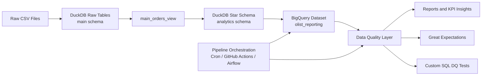

# Architecture Diagram Assets (Draw.io / Excalidraw)

Use this file to quickly create your architecture diagram in either tool.

## 1) Draw.io (Fastest Method via Mermaid Import)
In Draw.io:
1. `Arrange` -> `Insert` -> `Advanced` -> `Mermaid`
2. Paste the block below
3. Click `Insert`

## 2) Excalidraw Blueprint (Manual Placement)
Create these blocks from left to right:

1. `Raw CSV Files`
2. `DuckDB Raw Tables (main schema)`
3. `main_orders_view`
4. `DuckDB Star Schema (analytics)`
5. `BigQuery (olist_reporting)`
6. `Data Quality Layer`
7. `Great Expectations`
8. `Custom SQL DQ Tests`
9. `Reports and KPI Insights`
10. `Pipeline Orchestration (Cron/GHA/Airflow)`

Connectors:
1. `Raw CSV Files -> DuckDB Raw Tables`
2. `DuckDB Raw Tables -> main_orders_view`
3. `main_orders_view -> DuckDB Star Schema`
4. `DuckDB Star Schema -> BigQuery`
5. `BigQuery -> Data Quality Layer`
6. `Data Quality Layer -> Great Expectations`
7. `Data Quality Layer -> Custom SQL DQ Tests`
8. `Data Quality Layer -> Reports and KPI Insights`
9. `Pipeline Orchestration -> BigQuery`
10. `Pipeline Orchestration -> Data Quality Layer`

## 3) Suggested Styling
1. Storage nodes (CSV, DuckDB, BigQuery): blue
2. Quality nodes (DQ, GE, SQL tests): orange
3. Reporting nodes: green
4. Orchestration node: yellow
5. Use directional arrows left -> right for lineage clarity

## 4) File References
Architecture context:
- [architecture.md](./architecture.md)
- [workflow.md](./workflow.md)

Supporting artifacts:
- [schema_map.png](./schema_map.png)
- [final_project_report.md](./final_project_report.md)
