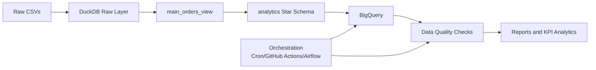

# Presentation for Olist Data Platform

**Presenter:** Team 10

**Audience:** NTU DSAI Corhot 4

---

## Executive Summary (2-3 minutes)
### Problem
Raw e-commerce data was not operationalized for reliable decision-making.

### Solution
Built an end-to-end pipeline:
1. DuckDB ingestion and transformation
2. Star schema modeling
3. ELT to BigQuery
4. Data quality testing (Great Expectations + SQL)
5. Orchestration-ready scheduling design

### Business Impact
1. Faster path from raw data to KPI insight
2. More trustworthy reporting through DQ controls
3. Scalable foundation for recurring analytics operations

---

## Business Value Proposition
### Value Delivered
1. Reduced manual data prep for analytics teams
2. Improved confidence in numbers shown to leadership
3. Repeatable pipeline pattern ready for automation

### Strategic Alignment
1. Supports data-driven planning and performance management
2. Enables scalable growth in BI use cases
3. Improves governance and auditability

### Interactive Aid
Audience poll: Which outcome matters most now?
1. Speed
2. Data trust
3. Scalability

---

## Technical Solution Overview

References:
- [workflow.md](./workflow.md)
- [architecture.md](./architecture.md)

---

## Key Technical Decisions
### Why these tools
1. DuckDB: fast local SQL transformations and modeling
2. BigQuery: scalable cloud analytics warehouse
3. Great Expectations + SQL: governance + transparent debugging
4. Notebook-first delivery: fast iteration and clear traceability

### Why not alternatives (for this phase)
1. Heavier orchestration stacks deferred until stable run cadence is proven
2. Simpler local-first flow prioritized to reduce setup friction

---

## Schema Design Justification
### Chosen Design: Star Schema (`analytics`)
1. Central fact table: `fact_orders`
2. Dimensions: customer, product, seller, geolocation, time

### Why it supports efficient querying
1. Predictable joins for BI workloads
2. Fast aggregations by date/category/customer segments
3. Cleaner semantic separation between measures and attributes
4. Surrogate keys and unknown members preserve referential integrity

Interactive aid: "Decision checkpoint"
- Ask: "Would a normalized model improve or slow executive reporting in this case?"

---

## Insights and Outcomes
### Insight Areas Produced
1. Monthly sales and order trends
2. Top-performing product categories
3. Customer segmentation patterns

### Supporting Assets
1. [monthly_sales_trends.png](./monthly_sales_trends.png)
2. [customer_segmentation_pie_chart.png](./customer_segmentation_pie_chart.png)
3. [schema_map.png](./schema_map.png)
4. [olist_dq_report.pdf](./olist_dq_report.pdf)
5. [Video Demo](https://github.com/chinwarsoon/dsai-5m-projects/releases/download/Video/Olist__Chaos_to_Clarity.mp4)
6. [PPTX Presentation](https://github.com/chinwarsoon/dsai-5m-projects/releases/download/Video/E-Commerce_Data_Ecosystem.pptx)

---

## Risk and Mitigation
### Risks
1. Manual notebook execution can create inconsistency
2. Dependency drift can break runs
3. Upstream schema/data changes can propagate defects
4. DQ checks may be bypassed without gated orchestration

### Mitigations
1. Schedule ELT + DQ in one orchestrated chain
2. Pin environment dependencies
3. Add schema contracts and run metadata logs
4. Fail runs on critical DQ violations

---

## Recommendations to Executives
### Business Executives
1. Use KPI trends for campaign and inventory timing
2. Use segmentation for retention and upsell
3. Monitor data trust as a leadership metric

### Technical Executives
1. Scriptize notebook critical paths
2. Move to managed orchestration as scale increases
3. Enforce automated DQ gates in production

---

## Q&A Handling Guide
### Concise Response Structure
1. Clarify the question in one sentence
2. Answer with one decision and one rationale
3. Point to evidence file/chart
4. Close with next step

### Likely Questions
1. Why DuckDB + BigQuery together?
2. Why star schema vs normalized schema?
3. How do we know data is trustworthy?
4. What is needed to productionize this now?

Interactive aid: keep this backup appendix open during live Q&A.

---

## Appendix: Relevant Files
1. [final_project_report.md](./final_project_report.md)
2. [main.ipynb](./main.ipynb)
3. [data_quality_test_plan.ipynb](./data_quality_test_plan.ipynb)
4. [great-expectation.ipynb](./great-expectation.ipynb)
5. [pipeline_orchestration_plan.ipynb](./pipeline_orchestration_plan.ipynb)
6. [workflow.md](./workflow.md)
7. [architecture.md](./architecture.md)
