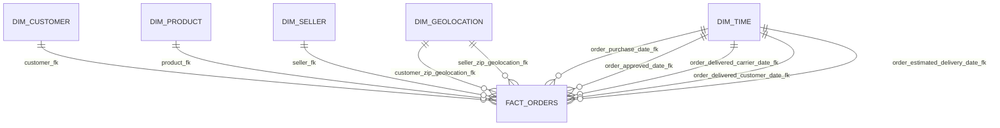

# Olist Data Platform Schema

This schema is derived from the project materials under `m2-project`, especially:

- `workflow/main.ipynb`
- `workflow/workflow.md`
- `architecture/architecture.md`
- `final_project_report.md`
- `final_presentation_deck.md`
- `notes-readme-first.md`

It reflects the implemented project structure: raw Olist source tables, a consolidated staging view, and an `analytics` star schema loaded onward to BigQuery.

## 1. Schema Layers

### Raw layer
Source CSV datasets loaded into DuckDB `main` schema:

- `olist_orders_dataset`
- `olist_customers_dataset`
- `olist_order_items_dataset`
- `olist_order_payments_dataset`
- `olist_products_dataset`
- `product_category_name_translation`
- `olist_sellers_dataset`
- `olist_geolocation_dataset`

### Staging / consolidation layer

- `main_orders_view`

This view is built with `LEFT JOIN`s across:

- `olist_orders_dataset` `o`
- `olist_customers_dataset` `c`
- `olist_order_items_dataset` `oi`
- `olist_order_payments_dataset` `op`

Join logic:

- `o.customer_id = c.customer_id`
- `o.order_id = oi.order_id`
- `o.order_id = op.order_id`

### Analytics warehouse layer
DuckDB `analytics` schema:

- `dim_customer`
- `dim_product`
- `dim_seller`
- `dim_geolocation`
- `dim_time`
- `fact_orders`

### Serving / quality layer

- BigQuery dataset: `olist_reporting`
- Data quality artifacts:
  - `workflow/data_quality_test_plan.ipynb`
  - `workflow/great-expectation.ipynb`
  - `output/olist_dq_report.pdf`

## 2. Staging View Schema

### `main_orders_view`
Columns assembled from the source notebooks:

- `order_id`
- `customer_id`
- `order_status`
- `order_purchase_timestamp`
- `order_approved_at`
- `order_delivered_carrier_date`
- `order_delivered_customer_date`
- `order_estimated_delivery_date`
- `customer_unique_id`
- `customer_zip_code_prefix`
- `customer_city`
- `customer_state`
- `order_item_id`
- `product_id`
- `seller_id`
- `shipping_limit_date`
- `price`
- `freight_value`
- `payment_sequential`
- `payment_type`
- `payment_installments`
- `payment_value`

This is the main denormalized input for star schema population.

## 3. Analytics Star Schema

### `analytics.dim_customer`
Purpose: customer descriptive attributes.

| Column | Type | Notes |
|---|---|---|
| `customer_pk` | `BIGINT` | Surrogate primary key |
| `customer_id` | `VARCHAR` | Natural key |
| `customer_unique_id` | `VARCHAR` | Business customer identifier |
| `customer_zip_code_prefix` | `BIGINT` | Customer ZIP prefix |
| `customer_city` | `VARCHAR` | Customer city |
| `customer_state` | `VARCHAR` | Customer state |

Population rule:

- `ROW_NUMBER() OVER (ORDER BY customer_id)` generates surrogate keys.
- Sourced from distinct customer attributes in `main_orders_view`.

### `analytics.dim_product`
Purpose: product descriptive attributes.

| Column | Type | Notes |
|---|---|---|
| `product_pk` | `BIGINT` | Surrogate primary key |
| `product_id` | `VARCHAR` | Natural key |
| `product_category_name` | `VARCHAR` | Original category |
| `product_category_name_english` | `VARCHAR` | English translation |
| `product_name_lenght` | `DOUBLE` | Source field spelling preserved |
| `product_description_lenght` | `DOUBLE` | Source field spelling preserved |
| `product_photos_qty` | `DOUBLE` | Product media count |
| `product_weight_g` | `DOUBLE` | Weight in grams |
| `product_length_cm` | `DOUBLE` | Length |
| `product_height_cm` | `DOUBLE` | Height |
| `product_width_cm` | `DOUBLE` | Width |

Population rule:

- Distinct products from `olist_products_dataset`
- Enriched by `product_category_name_translation`
- Includes an `Unknown` remediation row with `product_pk = 0` per notebook logic

### `analytics.dim_seller`
Purpose: seller descriptive attributes.

| Column | Type | Notes |
|---|---|---|
| `seller_pk` | `BIGINT` | Surrogate primary key |
| `seller_id` | `VARCHAR` | Natural key |
| `seller_zip_code_prefix` | `BIGINT` | Seller ZIP prefix |
| `seller_city` | `VARCHAR` | Seller city |
| `seller_state` | `VARCHAR` | Seller state |

Population rule:

- `ROW_NUMBER() OVER (ORDER BY seller_id)`
- Distinct rows from `olist_sellers_dataset`

### `analytics.dim_geolocation`
Purpose: reusable geographic lookup by ZIP prefix and coordinates.

| Column | Type | Notes |
|---|---|---|
| `geolocation_pk` | `BIGINT` | Surrogate primary key |
| `geolocation_zip_code_prefix` | `BIGINT` | ZIP prefix |
| `geolocation_lat` | `DOUBLE` | Latitude |
| `geolocation_lng` | `DOUBLE` | Longitude |
| `geolocation_city` | `VARCHAR` | City |
| `geolocation_state` | `VARCHAR` | State |

Population rule:

- `ROW_NUMBER() OVER (ORDER BY geolocation_zip_code_prefix, geolocation_lat, geolocation_lng)`
- Distinct rows from `olist_geolocation_dataset`
- Explicit `Unknown` row inserted with `geolocation_pk = 0`

### `analytics.dim_time`
Purpose: date dimension for all order lifecycle dates.

| Column | Type | Notes |
|---|---|---|
| `time_pk` | `BIGINT` | Surrogate key in `YYYYMMDD` format |
| `full_date` | `DATE` | Actual calendar date |
| `year` | `INTEGER` | Calendar year |
| `month` | `INTEGER` | Calendar month |
| `day` | `INTEGER` | Day of month |
| `quarter` | `INTEGER` | Quarter |
| `day_of_week` | `INTEGER` | 1=Sunday through 7=Saturday |
| `day_name` | `VARCHAR` | Weekday name |
| `month_name` | `VARCHAR` | Month name |
| `week_of_year` | `INTEGER` | Week number |
| `is_weekend` | `BOOLEAN` | Weekend flag |

Population rule:

- Date range is generated from all order-related date columns in `main_orders_view`
- One row per calendar date using `GENERATE_SERIES`
- Explicit `Unknown` row inserted with `time_pk = 0`

### `analytics.fact_orders`
Purpose: central transactional fact table for order-item-payment level analytics.

| Column | Type | Notes |
|---|---|---|
| `order_pk` | `BIGINT` | Surrogate primary key |
| `order_id` | `VARCHAR` | Natural order key |
| `customer_fk` | `BIGINT` | FK to `dim_customer.customer_pk` |
| `product_fk` | `BIGINT` | FK to `dim_product.product_pk` |
| `seller_fk` | `BIGINT` | FK to `dim_seller.seller_pk` |
| `order_purchase_date_fk` | `BIGINT` | FK to `dim_time.time_pk` |
| `order_approved_date_fk` | `BIGINT` | FK to `dim_time.time_pk` |
| `order_delivered_carrier_date_fk` | `BIGINT` | FK to `dim_time.time_pk` |
| `order_delivered_customer_date_fk` | `BIGINT` | FK to `dim_time.time_pk` |
| `order_estimated_delivery_date_fk` | `BIGINT` | FK to `dim_time.time_pk` |
| `customer_zip_geolocation_fk` | `BIGINT` | FK to `dim_geolocation.geolocation_pk` |
| `seller_zip_geolocation_fk` | `BIGINT` | FK to `dim_geolocation.geolocation_pk` |
| `order_status` | `VARCHAR` | Order status |
| `order_item_id` | `BIGINT` | Item line within order |
| `shipping_limit_date` | `VARCHAR` | Shipping cutoff from source |
| `price` | `DOUBLE` | Item price |
| `freight_value` | `DOUBLE` | Freight cost |
| `payment_sequential` | `BIGINT` | Payment sequence |
| `payment_type` | `VARCHAR` | Payment method |
| `payment_installments` | `BIGINT` | Installment count |
| `payment_value` | `DOUBLE` | Payment amount |

Population rule:

- Sourced from `main_orders_view`
- Joined to dimensions on natural keys
- Time keys are derived as `YYYYMMDD`
- Geolocation keys are resolved by ZIP prefix
- `COALESCE(..., 0)` maps missing dimension matches to `Unknown`
- `order_pk` is generated from an MD5-hash-based UUID expression

## 4. Relationship Map

## 5. Cardinality and Grain

### Fact table grain
`fact_orders` is modeled at a mixed operational grain that combines:

- order
- order item
- payment detail

This is why the DQ notebook reports duplicate failures on `(order_id, order_item_id)`: multiple payment rows can exist for the same order-item combination after joining payments into `main_orders_view`.

### Dimension conformance

- `dim_customer`, `dim_product`, `dim_seller`, `dim_time`, and `dim_geolocation` are reused across KPI queries.
- `dim_time` and `dim_geolocation` are role-played dimensions because the fact references them multiple times.

## 6. Data Quality Rules Reflected in the Schema

Implemented checks referenced in the project:

- Not-null checks on critical fields such as `fact_orders.order_id`
- Uniqueness checks such as `dim_customer.customer_pk`
- Referential integrity checks from fact FKs to dimension PKs
- Volumetry checks between DuckDB and BigQuery
- Business rule checks such as non-negative measures and key consistency

Known project-noted issues:

- `fact_orders.payment_value` had null failures in the DQ notebook
- `(order_id, order_item_id)` is not unique in `fact_orders`
- Unknown-member remediation is required to preserve referential integrity

## 7. Serving Schema in BigQuery

The `analytics` DuckDB tables are loaded into the BigQuery dataset:

- `olist_reporting.dim_customer`
- `olist_reporting.dim_product`
- `olist_reporting.dim_seller`
- `olist_reporting.dim_geolocation`
- `olist_reporting.dim_time`
- `olist_reporting.fact_orders`

These serve downstream KPI workloads:

- monthly sales trends
- category revenue analysis
- customer segmentation

## 8. Recommended Future Refinements

- Split payments into a separate fact if a strict order-item grain is required
- Convert `shipping_limit_date` to a true date key or date column
- Add explicit constraints and metadata tables for run logging
- Add a data dictionary for raw source tables if this becomes productionized
