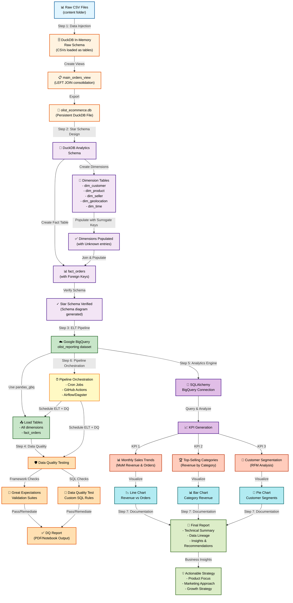

# E-commerce Data Pipeline Workflow

## Overview
This document outlines the complete workflow for transforming raw e-commerce data into actionable business insights.

---

## Workflow Diagram

---

## Detailed Step Breakdown

### **Step 1: Data Injection** 🚀
**Objective**: Load raw CSV files into DuckDB and create unified view

**Code Components:**
- Load all CSV files from `/content/` directory into DuckDB tables
- Create `main_orders_view` with LEFT JOINs:
  - `olist_orders_dataset`
  - `olist_customers_dataset`
  - `olist_order_items_dataset`
  - `olist_order_payments_dataset`
- Calculate basic statistics
- Export to persistent DuckDB file: `olist_ecommerce.db`

**Key Decisions:**
- DuckDB chosen for its SQL compatibility and ease of use
- `main_orders_view` consolidates 4 tables using `order_id` and `customer_id` joins

---

### **Step 2: Data Warehouse Design** 🌟
**Objective**: Design and implement a star schema for analytical queries

**Architecture:**

#### Dimension Tables:
1. **dim_customer** - Customer attributes (zip code, city, state)
2. **dim_product** - Product details (category, dimensions, weights)
3. **dim_seller** - Seller location information
4. **dim_geolocation** - Geographic coordinates and location data
5. **dim_time** - Date/time components (year, month, quarter, day of week, etc.)

#### Fact Table:
- **fact_orders** - Core transactional data
  - Foreign keys to all dimensions
  - Measures: `price`, `freight_value`, `payment_value`, `payment_installments`
  - Surrogate keys used throughout

**Key Implementation Details:**
- All dimension tables have surrogate keys (BIGINT PRIMARY KEY)
- `dim_time` populated using `GENERATE_SERIES()` to cover all dates in dataset
- Unknown entries (pk=0) inserted to handle missing dimension values
- `fact_orders` uses `COALESCE()` to default to 0 for unmatched keys

---

### **Step 3: ELT Pipeline to BigQuery** ☁️
**Objective**: Transfer star schema data to cloud data warehouse

**Process:**
1. Re-establish connection to persistent DuckDB file
2. Identify all tables in `analytics` schema
3. Extract each table to pandas DataFrame
4. Load to BigQuery using `pandas_gbq.to_gbq()`
5. Target: `olist_reporting` dataset in BigQuery

**Key Tools:**
- `pandas_gbq` - Direct DataFrame to BigQuery loading
- Google Cloud authentication via service account JSON
- SQLAlchemy for subsequent analytical queries

---

### **Step 4: Data Quality Testing** 🛡️
**Objective**: Validate data integrity across DuckDB and BigQuery

**Test Suite:**

1. **Volumetry Check**
   - Compare record counts: Local DuckDB vs BigQuery
   - Verify no data loss during ELT

2. **Null Value Checks**
   - Verify critical columns have no unexpected nulls
   - Example: `order_id` in `fact_orders`

3. **Duplicate Detection**
   - Ensure uniqueness constraints maintained
   - Example: `product_id` in `dim_product`

4. **Referential Integrity**
   - Validate foreign key relationships
   - Check that all `*_fk` values exist in corresponding dimension tables
   - Remediation: Insert Unknown entries where needed

**Output:** PDF report with test results

---

### **Step 5: Analytics Engine** 📊
**Objective**: Generate KPIs and business insights using BigQuery

**Connection Method:** SQLAlchemy with BigQuery dialect

#### KPI 1: Monthly Sales Trends (MoM Growth)
- Query: Aggregate `payment_value` and order count by month
- Metrics: Total revenue, total orders, revenue growth rate
- Visualization: Dual-axis line chart (revenue vs order count)

#### KPI 2: Top-Selling Products (Revenue by Category)
- Query: Join `fact_orders` + `dim_product`, aggregate by category
- Metrics: Category revenue, items sold
- Visualization: Horizontal bar chart (Top 10 categories)

#### KPI 3: Customer Segmentation (RFM Lite)
- Query: Calculate frequency (order count) and monetary value per customer
- Segmentation Logic:
  - **VIP/Loyal**: Frequency > 1 AND Monetary Value > $500
  - **High Value/New**: Frequency = 1 AND Monetary Value > $200
  - **Standard**: All others
- Result: 76.1% Standard, 23.5% High Value/New, 0.4% VIP/Loyal
- Visualization: Pie chart showing segment distribution

---

### **Step 6: Pipeline Orchestration** (Optional - On Hold)
**Future Enhancement:** Airflow/Prefect for automated scheduling and monitoring

---

### **Step 7: Documentation & Presentation** 📄
**Output:**
- Complete technical report
- Data lineage diagram
- Star schema relationship map (generated via Graphviz)
- Analysis findings and business insights
- Actionable recommendations for new e-commerce ventures

---

## Business Insights Summary

### Key Findings:
1. **Growth Trend**: Consistent upward trajectory in revenue and orders with seasonal fluctuations
2. **Product Performance**: Top categories (bed_bath_table, health_beauty, computers_accessories) drive majority of revenue
3. **Customer Behavior**: 
   - Large standard customer base (76%) opportunity for conversion
   - Small but valuable VIP segment (0.4%) requires retention focus
   - High Value/New segment (23.5%) prime for loyalty conversion

### Strategic Recommendations:
- **Product Strategy**: Niche focus on top-performing categories
- **Marketing**: Targeted campaigns for High Value/New segment conversion
- **Operations**: Optimize supply chain for chosen niches, leverage seasonal trends

---

## Technical Stack

| Component | Tool | Purpose |
|-----------|------|---------|
| **Raw Data Storage** | DuckDB | In-memory & persistent database |
| **Data Consolidation** | SQL (DuckDB) | View creation & transformations |
| **Schema Design** | SQL DDL/DML | Dimension & fact table creation |
| **Cloud Data Warehouse** | Google BigQuery | Scalable analytics platform |
| **ELT Tool** | pandas_gbq | Data extraction & loading |
| **Analytics Connection** | SQLAlchemy + sqlalchemy-bigquery | Query interface |
| **Visualization** | matplotlib + seaborn | Chart generation |
| **Reporting** | FPDF | PDF report generation |
| **Languages** | Python, SQL | Scripting & querying |
| **Environment** | Google Colab | Cloud development platform |

---

## Data Quality Metrics

- **Volumetry**: ✅ All records transferred successfully
- **Null Checks**: ✅ Critical fields validated
- **Duplicates**: ✅ Uniqueness constraints maintained
- **Referential Integrity**: ✅ Foreign key relationships validated with Unknown entry remediation

---

## Next Steps & Future Enhancements

1. **Automated Orchestration**: Implement Airflow/Prefect for scheduled runs
2. **Enhanced Analytics**: Add predictive models (churn, lifetime value)
3. **Real-time Monitoring**: Implement streaming pipeline for real-time KPIs
4. **Advanced Segmentation**: RFM full analysis with temporal components
5. **Geographic Analysis**: Leverage geolocation data for regional insights
6. **A/B Testing Framework**: Integrate experimentation capabilities

---

**Generated**: As part of E-commerce Data Pipeline Project, Module 2
